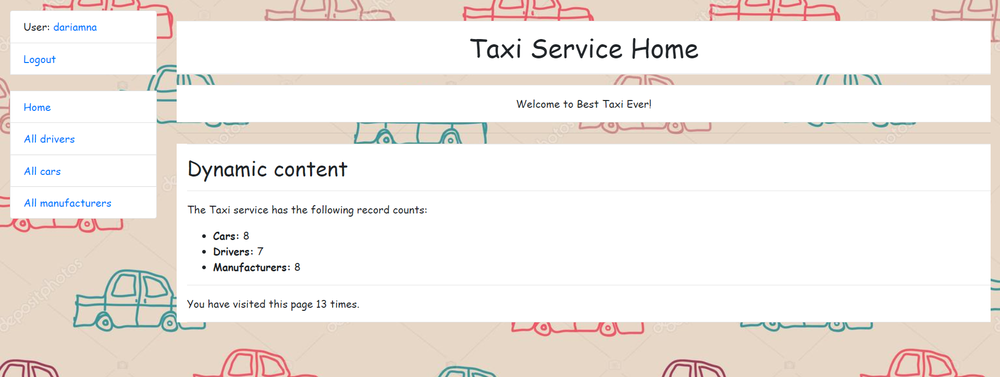

# Taxi Service Project

Django project for managing cars, drivers and manufacturers in taxi service.

# Check it out!

[Taxi service project deployed to heroku](https://my-project-taxi-service.herokuapp.com/accounts/login/)

Use username: user, password: user12345 to get familiar the project.

## Installation

Python3 must be already installed.

``` shell
git clone https://github.com/daria-niklaevna/my-project
cd my-project
python3 -m venv venv
source venv/bin/activate
pip install -r requirements.txt
python manage.py runserver # starts Django Server
```

## Features

* Authentication functionality for Driver/User
* Managing cars drivers & manufacturers directly from website interface
* Powerful admin panel for advanced managing


## Demo



